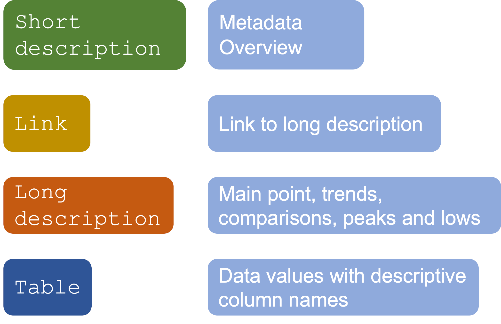
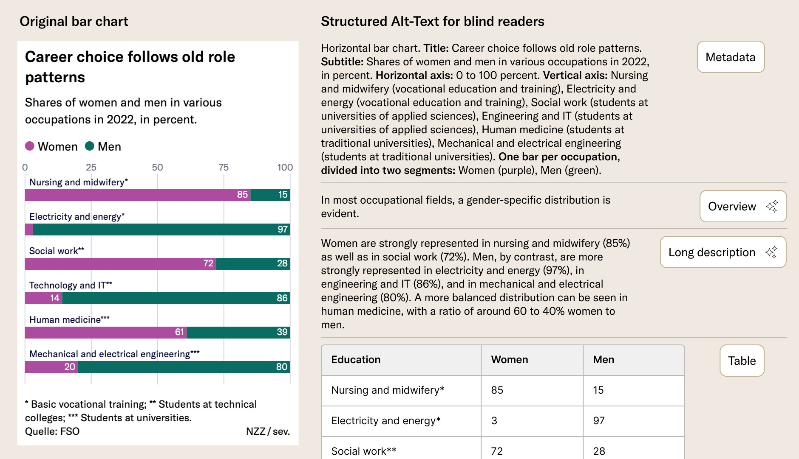
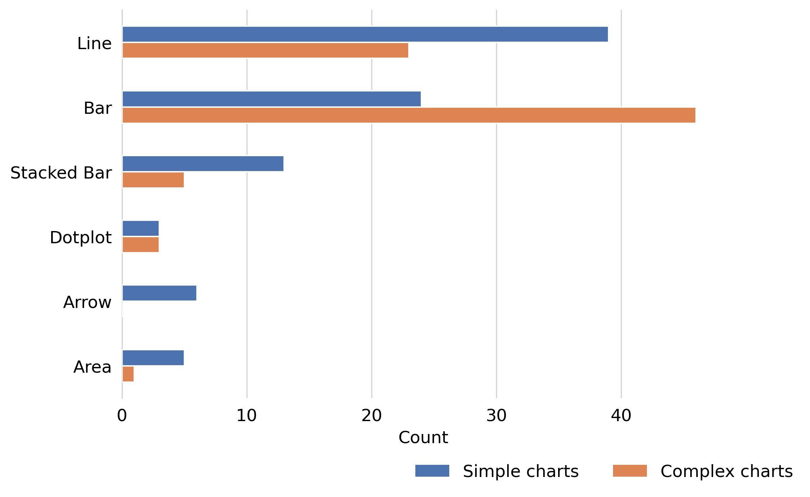

# Viz4VisuallyImpaired

Automatic generation and evaluation of alt texts for NZZ charts, to improve accessibility for visually impaired people (PIVs).

## What it does

- Cleans and prepares NZZ chart data
- Generates alt texts using Google Gemini 2.5 Flash
- Stores charts, metadata, and alt texts in a SQLite database
- Evaluates alt texts using multiple methods (LLM-as-a-judge, SBERT, character count, interviews)
- Compares generated texts against a gold standard built from interviews with PIVs and a linguistic expert
- Reports and visualizes results

## Alt text structure

This is our synthesized alt text structure 



An example for an NZZ chart would look like this




## Data

The NZZ used in this project distribute over the following chart types. 


The scope of this project is limited to line, bar and stacked bar charts.


## Folder structure

```text
VIZ4VISUALLYIMPAIRED/
├── data/
│   ├── NZZ_original/              # Raw NZZ files
│   └── nzz_metadata.csv           # Chart metadata
│
├── notebooks/
│   ├── a_generate_dfs_for_db.ipynb
│   ├── b_create_db_for_chart_data.ipynb
│   ├── c_alt_text_generation_pipeline.ipynb
│   ├── d1_llm_as_a_judge_evaluation_pipeline.ipynb
│   ├── d2_llm_as_a_judge_golden_standard.ipynb
│   ├── e_viz_analysis.ipynb
│   ├── f_best_text_all_texts_per_chart_id.ipynb
│   └── gold_standard_alt_texts_raw.txt
│
├── outputs/
│   ├── eval_figures/                  # Evaluation plots
│   ├── report_out_gold_standard/      # Gold standard evaluation reports
│   └── report_out_run/                # Model run reports
│
├── src/
│   ├── a_func_generate_dfs_for_db.py
│   ├── b_func_prompt_texts.py
│   ├── c_func_alt_text_generation_pipeline.py
│   ├── d1_func_llm_as_a_judge_generated.py
│   ├── d2_func_llm_as_a_judge_gold_standard.py
│   └── e_func_viz_pipeline.py
│
├── visuals/
│   ├── alt_text_structure.png
│   ├── visual_example.png
│   └── chart_type_distribution.png
│
├── chart_database.db                  # Main SQLite database
├── report.pdf
├── gold_standards.pdf
├── Pipfile
├── Pipfile.lock
└── README.md
```

## Pipeline

### 1. Data preparation
Cleans raw chart data and metadata into structured DataFrames.
Notebook: `a_generate_dfs_for_db.ipynb`

### 2. Database creation
Creates a SQLite database to store chart metadata, data values, generated alt texts, and evaluation results.
Notebook: `b_create_db_for_chart_data.ipynb`

### 3. Alt text generation
Generates alt texts using prompt templates and an LLM. Multiple candidates can be generated per chart.
Notebook: `c_alt_text_generation_pipeline.ipynb`

### 4. Evaluation (LLM-as-a-judge)
An LLM evaluates the generated alt texts on six criteria: clarity, completeness, perceived completeness, conciseness, neutrality, and factual correctness.
Notebook: `d1_llm_as_a_judge_evaluation_pipeline.ipynb`

### 5. Gold standard comparison
Generated texts are compared against manually written gold standard alt texts.
Notebook: `d2_llm_as_a_judge_golden_standard.ipynb`

### 6. Visualization and reporting
Results are aggregated, visualized, and exported. The best alt text per chart is selected.
Notebooks: `e_viz_analysis.ipynb`, `f_best_text_all_texts_per_chart_id.ipynb`

## Outputs

| Location | Contents |
|---|---|
| `outputs/eval_figures/` | Evaluation plots |
| `outputs/generated_alt_texts/` | Generated alt texts with evaluation scores |
| `outputs/LLMjudged_gold_standard_alt_texts/` | LLM-judged gold standard alt texts |